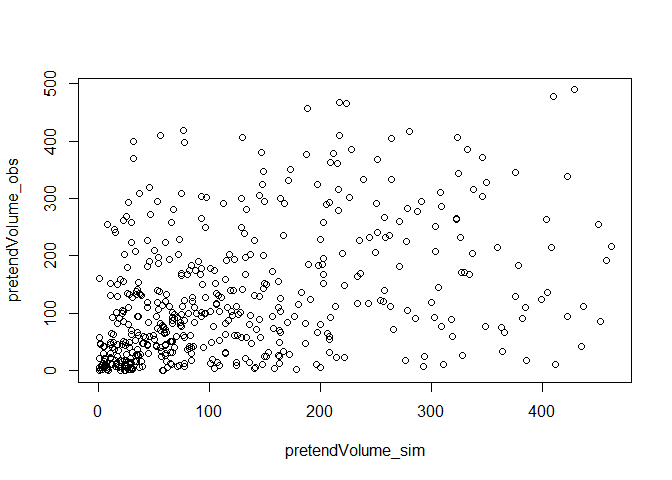

Volume v Depth Experiments
================

## Volume vs Depth

Making some imaginary data to test whether volume and depth should have
the same agreement. The SD-6 WRG analysis suggests that volume agrees
better than depth. Question is: if we are dividing by the same area,
should this be possible?

## Make some imaginary data

Will make data where depth is not correlated (random numbers), area is
perfectly correlated, and volume is depth\*area.

``` r
set.seed(1)
pretendDepth_sim <- runif(500)
pretendDepth_obs <- runif(500)
pretendArea_sim <- seq(1, 500)
pretendArea_obs <- seq(1, 500)
pretendVolume_sim <- pretendDepth_sim*pretendArea_sim
pretendVolume_obs <- pretendDepth_obs*pretendArea_obs
```

## Compare pretend irrigation depth

Depth not correlated - random numbers.

``` r
plot(pretendDepth_sim, pretendDepth_obs)
```

<!-- -->

``` r
summary(lm(pretendDepth_obs ~ pretendDepth_sim))
```

    ## 
    ## Call:
    ## lm(formula = pretendDepth_obs ~ pretendDepth_sim)
    ## 
    ## Residuals:
    ##      Min       1Q   Median       3Q      Max 
    ## -0.51431 -0.24874 -0.00236  0.25135  0.51579 
    ## 
    ## Coefficients:
    ##                  Estimate Std. Error t value Pr(>|t|)    
    ## (Intercept)       0.47901    0.02647  18.094   <2e-16 ***
    ## pretendDepth_sim  0.04987    0.04638   1.075    0.283    
    ## ---
    ## Signif. codes:  0 '***' 0.001 '**' 0.01 '*' 0.05 '.' 0.1 ' ' 1
    ## 
    ## Residual standard error: 0.2935 on 498 degrees of freedom
    ## Multiple R-squared:  0.002316,   Adjusted R-squared:  0.0003123 
    ## F-statistic: 1.156 on 1 and 498 DF,  p-value: 0.2828

## Compare pretend irrigated area

Area perfectly correlated - defined equal to each other.

``` r
plot(pretendArea_sim, pretendArea_obs)
```

<!-- -->

``` r
summary(lm(pretendArea_obs ~ pretendArea_sim))
```

    ## Warning in summary.lm(lm(pretendArea_obs ~ pretendArea_sim)): essentially
    ## perfect fit: summary may be unreliable

    ## 
    ## Call:
    ## lm(formula = pretendArea_obs ~ pretendArea_sim)
    ## 
    ## Residuals:
    ##        Min         1Q     Median         3Q        Max 
    ## -3.870e-12 -8.000e-16  8.100e-15  1.620e-14  1.951e-13 
    ## 
    ## Coefficients:
    ##                   Estimate Std. Error    t value Pr(>|t|)    
    ## (Intercept)     -3.254e-13  1.564e-14 -2.081e+01   <2e-16 ***
    ## pretendArea_sim  1.000e+00  5.409e-17  1.849e+16   <2e-16 ***
    ## ---
    ## Signif. codes:  0 '***' 0.001 '**' 0.01 '*' 0.05 '.' 0.1 ' ' 1
    ## 
    ## Residual standard error: 1.746e-13 on 498 degrees of freedom
    ## Multiple R-squared:      1,  Adjusted R-squared:      1 
    ## F-statistic: 3.418e+32 on 1 and 498 DF,  p-value: < 2.2e-16

## Compare pretend irrigation volume

Multiplying depth \* area.

``` r
plot(pretendVolume_sim, pretendVolume_obs)
```

<!-- -->

``` r
summary(lm(pretendVolume_obs ~ pretendVolume_sim))
```

    ## 
    ## Call:
    ## lm(formula = pretendVolume_obs ~ pretendVolume_sim)
    ## 
    ## Residuals:
    ##     Min      1Q  Median      3Q     Max 
    ## -231.16  -67.65  -26.57   55.12  315.11 
    ## 
    ## Coefficients:
    ##                   Estimate Std. Error t value Pr(>|t|)    
    ## (Intercept)       72.00026    6.74659   10.67   <2e-16 ***
    ## pretendVolume_sim  0.41444    0.04089   10.14   <2e-16 ***
    ## ---
    ## Signif. codes:  0 '***' 0.001 '**' 0.01 '*' 0.05 '.' 0.1 ' ' 1
    ## 
    ## Residual standard error: 100.8 on 498 degrees of freedom
    ## Multiple R-squared:  0.171,  Adjusted R-squared:  0.1694 
    ## F-statistic: 102.7 on 1 and 498 DF,  p-value: < 2.2e-16
