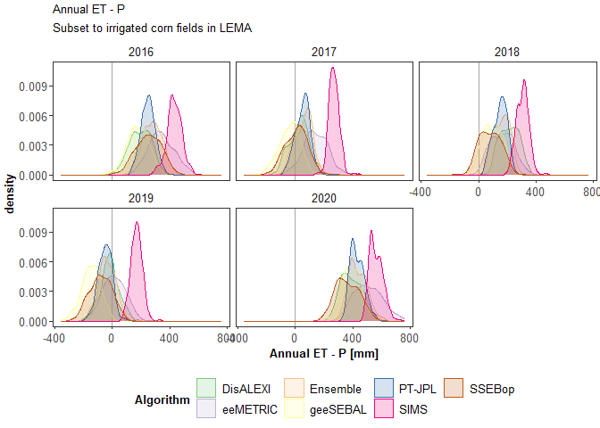
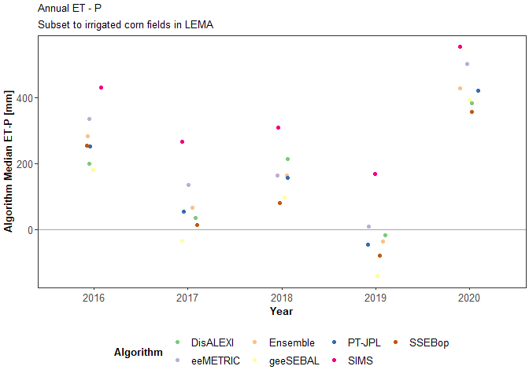
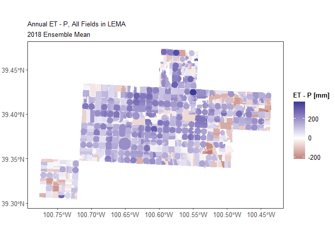
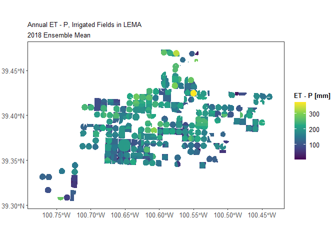

Compare OpenET and WIMAS irrigation at LEMA Scale
================

This script compares irrigation reported in the WIMAS dataset and
estimated from OpenET data.

# 1. Calculate WIMAS annual water use in the LEMA

## 1.1 Load data and pre-process

``` r
# load necessary paths and packages
source(file.path("..", "code", "paths+packages.R"))

# load WIMAS water use data and LEMA boundary
sf_wimas <- st_read(file.path(dir_data, "WIMAS_WaterUse_1990to2020_SD6+10mi.gpkg"))
sf_sd6 <- st_read(file.path(dir_data, "GIS", "sd6_areas", "sd_6.shp"))
```

``` r
# find points within SD-6
sf_wimas$SD6 <- as.logical(st_is_within_distance(sf_wimas, sf_sd6, dist = 1))

# check SD-6 identification
ggplot() +
  geom_sf(data = sf_wimas, aes(color = SD6)) +
  geom_sf(data = sf_sd6, fill = NA, color = "red")
```

<!-- -->

## 1.2 Sum to total within LEMA

``` r
# rearrange WIMAS data into long-format
df_wimas <- 
  sf_wimas %>% 
  st_drop_geometry() %>% 
  dplyr::select(PDIV_ID, SD6, starts_with("AF_USED_IRR_")) %>% 
  pivot_longer(-c(PDIV_ID, SD6), values_to = "WellIrrigation_af") %>% 
  replace_na(list(SD6 = F)) %>% 
  mutate(Year = as.numeric(str_sub(name, start = -4, end = -1)))

# convert to cubic meters
df_wimas$WellIrrigation_m3 <- df_wimas$WellIrrigation_af*1233.4818375475

# subset to SD6 wells only and sum annual total
df_wimas_irr_total <-
  df_wimas %>% 
  subset(SD6) %>% 
  group_by(Year) %>% 
  summarize(TotalIrrigation_m3 = sum(WellIrrigation_m3))

# summarize and plot
head(df_wimas_irr_total)
```

    ## # A tibble: 6 × 2
    ##    Year TotalIrrigation_m3
    ##   <dbl>              <dbl>
    ## 1  1990          48357328.
    ## 2  1991          49522184.
    ## 3  1992          23150164.
    ## 4  1993          17575702.
    ## 5  1994          38928150.
    ## 6  1995          39254542.

``` r
ggplot(subset(df_wimas_irr_total, Year >= 2000), aes(x = Year, y = TotalIrrigation_m3)) +
  geom_point() + geom_line()
```

<!-- -->

# 2. Calculate OpenET annual water use in the LEMA

## 2.1 Load and combine necessary data

``` r
# load field attributes
fields_spatial <- 
  readr::read_csv(file.path("..", "data", "Fields_Attributes-Spatial.csv"))
fields_irrigation <- 
  readr::read_csv(file.path("..", "data", "Fields_Attributes-Irrigation-AnnualAIM.csv")) |> 
  mutate(Irrigation = IrrigatedPrc > 0.5)
fields_landcover <- 
  readr::read_csv(file.path("..", "data", "Fields_Attributes-LandCover-AnnualCDL.csv")) |> 
  dplyr::left_join(crop_names.groups, by = "CropCode")

# load ET and met data
#  ts = timescale of aggregation - can be "Annual", "GrowingSeason", "WaterYear"
ts <- "Annual"
fields_et <- 
  file.path(dir_openet, paste0("ET_", ts, "_All_FieldsNoDups.csv")) |> 
  read_csv() |> 
  subset(Year <= 2020)
fields_met <- read_csv(file.path("..", "data", paste0("gridmet_", ts, "ByField.csv")))

# join data and subset to only LEMA
fields_alldata <-
  left_join(fields_et, fields_met, by = c("Year", "UID")) |> 
  left_join(fields_irrigation, by = c("Year", "UID")) |> 
  left_join(fields_landcover, by = c("Year", "UID")) |> 
  left_join(fields_spatial, by = "UID") |> 
  subset(within_lema)

head(fields_alldata)
```

    ## # A tibble: 6 × 17
    ##      UID  Year Algorithm ET_mm precip_mm ETo_mm ETr_mm Irrigat…¹ Irrig…² CropC…³
    ##    <dbl> <dbl> <chr>     <dbl>     <dbl>  <dbl>  <dbl>     <dbl> <lgl>     <dbl>
    ## 1 347501  2016 disalexi   704.      623.  1531.  2171.     0.768 TRUE          1
    ## 2 347501  2016 eemetric   909.      623.  1531.  2171.     0.768 TRUE          1
    ## 3 347501  2016 ensemble   811.      623.  1531.  2171.     0.768 TRUE          1
    ## 4 347501  2016 geesebal   690.      623.  1531.  2171.     0.768 TRUE          1
    ## 5 347501  2016 ptjpl      768.      623.  1531.  2171.     0.768 TRUE          1
    ## 6 347501  2016 sims       964.      623.  1531.  2171.     0.768 TRUE          1
    ## # … with 7 more variables: pctcov <dbl>, CropName <chr>, CropGroup <chr>,
    ## #   CropGroupCoarse <chr>, within_lema <lgl>, within_buffer <lgl>,
    ## #   area_m2 <dbl>, and abbreviated variable names ¹​IrrigatedPrc, ²​Irrigation,
    ## #   ³​CropCode

## 2.2 Calculate and plot precipitation deficit

``` r
# precipitation deficit = ET - P
fields_alldata$ET.P_mm <- fields_alldata$ET_mm - fields_alldata$precip_mm

# plot distribution of ET-P irrigated LEMA corn fields
fields_alldata |> 
  subset(Irrigation & CropName == "Corn") |> 
  ggplot() +
  geom_vline(xintercept = 0, color = col.gray) +
  geom_density(aes(x = ET.P_mm, fill = Algorithm, color = Algorithm), alpha = 0.2) +
  facet_wrap( ~ Year) +
  scale_x_continuous(name = paste0(ts, " ET - P [mm]")) +
  scale_color_brewer(labels = labs_algorithms, type = "qual") +
  scale_fill_brewer(labels = labs_algorithms, type = "qual") +
  labs(title = paste0(ts, " ET - P"), subtitle = "Subset to irrigated corn fields in LEMA") +
  theme(legend.position = "bottom") +
  NULL
```

<!-- -->

``` r
# calculate median ET-P for each year, irrigated LEMA corn fields
fields_alldata |> 
  subset(Irrigation & CropName == "Corn") |> 
  group_by(Year, Algorithm) |> 
  summarize(ET.P_mm_median = median(ET.P_mm)) |> 
  ggplot() +
  geom_hline(yintercept = 0, color = col.gray) +
  geom_jitter(aes(x = factor(Year), y = ET.P_mm_median, color = Algorithm),
              width = 0.1) +
  scale_x_discrete(name = "Year") +
  scale_y_continuous(name = "Algorithm Median ET-P [mm]") +
  scale_color_brewer(labels = labs_algorithms, type = "qual") +
  labs(title = paste0(ts, " ET - P"), subtitle = "Subset to irrigated corn fields in LEMA") +
  theme(legend.position = "bottom") +
  NULL
```

<!-- -->

``` r
# map 2018 Ensemble Mean ET-P as representative example
sf_fields  <- 
  st_read(file.path("..", "data", "Fields_NoDups.shp"))
```

    ## Reading layer `Fields_NoDups' from data source 
    ##   `C:\Users\s947z036\WorkGits\SD-6_MapWaterConservation\data\Fields_NoDups.shp' 
    ##   using driver `ESRI Shapefile'
    ## Simple feature collection with 11314 features and 2 fields
    ## Geometry type: POLYGON
    ## Dimension:     XY
    ## Bounding box:  xmin: -423875.3 ymin: 1803101 xmax: -362791.8 ymax: 1854546
    ## Projected CRS: USA_Contiguous_Albers_Equal_Area_Conic_USGS_version

``` r
sf_fields_withET <- 
  left_join(sf_fields, subset(fields_alldata, Year == 2018 & Algorithm == "ensemble")) |> 
  subset(is.finite(ET_mm))

ggplot() +
  geom_sf(data = sf_fields_withET, aes(fill = ET.P_mm), color = NA) +
  scale_fill_gradient2(name = "ET - P [mm]") +
  labs(title = paste0(ts, " ET - P, All Fields in LEMA"), subtitle = "2018 Ensemble Mean")
```

<!-- -->

``` r
ggplot() +
  geom_sf(data = subset(sf_fields_withET, Irrigation), aes(fill = ET.P_mm), color = NA) +
  scale_fill_viridis_c(name = "ET - P [mm]") +
  labs(title = paste0(ts, " ET - P, Irrigated Fields in LEMA"), subtitle = "2018 Ensemble Mean")
```

<!-- -->
\## 2.3 Estimate total LEMA irrigation

``` r
# subset to only irrigated fields 
fields_lema <- 
  fields_alldata |> 
  subset(Irrigation)

# set any fields with ET - P < 0 = 0 (negative irrigation impossible)
fields_lema$FieldIrrigation_mm <- ifelse(fields_lema$ET.P_mm < 0, 0, fields_lema$ET.P_mm)

# calculate irrigation volume: mm --> m3
#  mm/1000 = m
#  m*area = m3
fields_lema$FieldIrrigation_m3 <- (fields_lema$FieldIrrigation_mm/1000)*fields_lema$area_m2

# summarize to total by year and algorithm
df_OpenET_irr_total <-
  fields_lema %>% 
  group_by(Year, Algorithm) %>% 
  summarize(TotalIrrigation_m3 = sum(FieldIrrigation_m3))
```

# 3. Merge WIMAS and OpenET estimates to compare

``` r
# merge data
df_merge <- left_join(df_OpenET_irr_total, df_wimas_irr_total, by = "Year",
                      suffix = c("_OpenET", "_WIMAS")) |> 
  subset(Year >= 2016)

# plot time series
ggplot(df_merge) +
  # WIMAS data
  geom_point(aes(x = Year, y = TotalIrrigation_m3_WIMAS/1e6), color = "black", size = 2) +
  geom_line(aes(x = Year, y = TotalIrrigation_m3_WIMAS/1e6), color = "black", linewidth = 2) +
  # OpenET data
  geom_point(aes(x = Year, y = TotalIrrigation_m3_OpenET/1e6, color = Algorithm)) + 
  geom_line(aes(x = Year, y = TotalIrrigation_m3_OpenET/1e6, color = Algorithm), show.legend = F) +
  # aesthetics
  scale_y_continuous(name = "Estimated Irrigation [million m\u00b3]") +
  scale_color_brewer(name = NULL, type = "qual", labels = labs_algorithms) +
  labs(title = "Estimated total annual irrigation in SD-6 LEMA",
       subtitle = "Black line = WIMAS reported, colored lines = OpenET estimates") +
  theme(legend.position = "bottom")
```

<!-- -->

``` r
# scatter plot
ggplot(df_merge, aes(x = TotalIrrigation_m3_WIMAS/1e6, y = TotalIrrigation_m3_OpenET/1e6)) +
  # WIMAS data
  geom_point(aes(color = Algorithm)) +  
  geom_abline(intercept = 0, slope = 1, color = col.gray) +
  scale_y_continuous(name = "Estimated Irrigation\n[million m\u00b3]", 
                     limits = c(min(df_merge$TotalIrrigation_m3_OpenET/1e6), 
                                max(df_merge$TotalIrrigation_m3_OpenET/1e6))) +
  scale_x_continuous(name = "WIMAS Reported Irrigation [million m\u00b3]", 
                     limits = c(min(df_merge$TotalIrrigation_m3_OpenET/1e6), 
                                max(df_merge$TotalIrrigation_m3_OpenET/1e6))) +
  scale_color_brewer(name = "Algorithm", type = "qual", labels = labs_algorithms) +
  stat_smooth(method = "lm") +
  theme(legend.position = "bottom") +
  labs(title = "Estimated total annual irrigation in SD-6 LEMA")
```

<!-- -->
