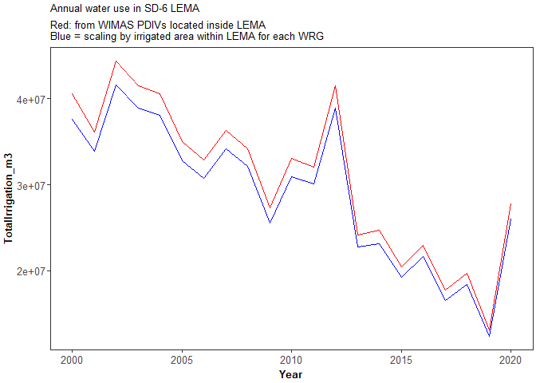
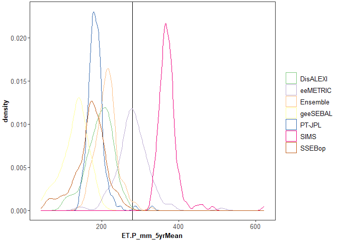

Compare OpenET and WIMAS irrigation at LEMA Scale
================

This script compares irrigation reported in the WIMAS dataset and
estimated from OpenET data.

# 1. Calculate WIMAS annual water use in the LEMA

## 1.1 Load data and pre-process

``` r
# load necessary paths and packages
source(file.path("..", "code", "paths+packages.R"))

# load WIMAS water use data and LEMA boundary
sf_wimas <- st_read(file.path(dir_data, "WIMAS_WaterUse_1990to2020_SD6+10mi.gpkg"))
sf_sd6 <- st_read(file.path(dir_data, "GIS", "sd6_areas", "sd_6.shp"))

# load field attributes
fields_spatial <- 
  readr::read_csv(file.path("..", "data", "Fields_Attributes-Spatial.csv"))
fields_irrigation <- 
  readr::read_csv(file.path("..", "data", "Fields_Attributes-Irrigation-AnnualAIM.csv")) |> 
  mutate(Irrigation = IrrigatedPrc > 0.5)
fields_landcover <- 
  readr::read_csv(file.path("..", "data", "Fields_Attributes-LandCover-AnnualCDL.csv")) |> 
  dplyr::left_join(crop_names.groups, by = "CropCode")
```

``` r
# find points within SD-6
sf_wimas$SD6 <- as.logical(st_is_within_distance(sf_wimas, sf_sd6, dist = 1))

# check SD-6 identification
ggplot() +
  geom_sf(data = sf_wimas, aes(color = SD6)) +
  geom_sf(data = sf_sd6, fill = NA, color = "red")
```

<!-- -->

## 1.2 Look for wells near border that irrigate a mixture of fields inside and outside LEMA

``` r
# compare list of UIDs for irrigated fields and fields that are in LEMA
UID_LEMA <- subset(fields_spatial, within_lema)$UID
UID_irr <- unique(subset(fields_irrigation, Irrigation)$UID)
UID_irr_LEMA <- UID_LEMA[UID_LEMA %in% UID_irr]
UID_irr_notLEMA <- UID_irr[!(UID_irr %in% UID_irr_LEMA)]

# load water rights groups by field ID
WRG_UID_intersection <- read_csv(file.path(dir_data, "data_WRGs_fromBrownie_20221006", "extracted_layers", "AIM_wimasPU_intersection_table.csv"))

# plot distribution fo OVLP_PCT - determine cutoff
ggplot(WRG_UID_intersection, aes(x = OVLP_PCT)) +
  geom_histogram(breaks = seq(0, 1, 0.05))
```

<!-- -->

``` r
# trim based on cutoff
OVLP_cutoff <- 0.25
WRG_UID_intersection_trim <- subset(WRG_UID_intersection, OVLP_PCT > OVLP_cutoff)

# identify WRGs that have irrigated fields in LEMA and outside LEMA
WRGs_LEMA <- unique(subset(WRG_UID_intersection_trim, UID %in% UID_irr_LEMA)$WR_GROUP)
WRGs_notLEMA <- unique(subset(WRG_UID_intersection_trim, UID %in% UID_irr_notLEMA)$WR_GROUP)

# for each WRG, calculate fraction of irrigation area inside LEMA
WRGs_all <- unique(WRG_UID_intersection_trim$WR_GROUP)
df_WRG_LEMAfrac <- tibble(WR_GROUP = WRGs_all,
                          LEMA_irrFieldArea_m2 = NaN,
                          notLEMA_irrFieldArea_m2 = NaN)

for (i in 1:length(WRGs_all)){
  w <- df_WRG_LEMAfrac$WR_GROUP[i]
  
  # get area of fields in LEMA
  w_UIDs <- unique(subset(WRG_UID_intersection_trim, WR_GROUP == w)$UID)
  w_UIDs_LEMA <- w_UIDs[w_UIDs %in% UID_irr_LEMA]
  w_UIDs_notLEMA <- w_UIDs[w_UIDs %in% UID_irr_notLEMA]
  
  df_WRG_LEMAfrac$LEMA_irrFieldArea_m2[i] <-
    sum(fields_spatial$area_m2[fields_spatial$UID %in% w_UIDs_LEMA])
  df_WRG_LEMAfrac$notLEMA_irrFieldArea_m2[i] <-
    sum(fields_spatial$area_m2[fields_spatial$UID %in% w_UIDs_notLEMA])
}

# calculate irrigated fraction
df_WRG_LEMAfrac$LEMA_irrFieldArea_fraction <- 
  df_WRG_LEMAfrac$LEMA_irrFieldArea_m2/(df_WRG_LEMAfrac$LEMA_irrFieldArea_m2 + df_WRG_LEMAfrac$notLEMA_irrFieldArea_m2)

# get rid of WRGs that don't have irrigated fields
df_WRG_LEMAfrac <- subset(df_WRG_LEMAfrac, is.finite(LEMA_irrFieldArea_fraction))

# find number of split WRGs across LEMA/notLEMA border
df_WRG_LEMAfrac$WR_GROUP[df_WRG_LEMAfrac$LEMA_irrFieldArea_fraction >= 0.01 & df_WRG_LEMAfrac$LEMA_irrFieldArea_fraction <= 0.99]
```

    ## [1]  2297  3769  4166  9166  9979 10762 13425

## 1.3 Sum to total within LEMA, scaling split WRGs based on fraction within LEMA

``` r
# rearrange WIMAS data into long-format
df_wimas <- 
  sf_wimas %>% 
  st_drop_geometry() %>% 
  dplyr::select(PDIV_ID, SD6, starts_with("AF_USED_IRR_")) %>% 
  pivot_longer(-c(PDIV_ID, SD6), values_to = "WellIrrigation_af") %>% 
  replace_na(list(SD6 = F)) %>% 
  mutate(Year = as.numeric(str_sub(name, start = -4, end = -1)),
         WellIrrigation_m3 = WellIrrigation_af*1233.4818375475) # convert to cubic meters

# load WIMAS PDIVs with WR_GROUPS
sf_wimas_withWRGs <- st_read(file.path(dir_data, "data_WRGs_fromBrownie_20221006", "extracted_layers", "wimas_pdfile.gpkg"))
```

    ## Reading layer `wimas_pdfile' from data source 
    ##   `C:\Users\s947z036\OneDrive - University of Kansas\Research\LEMA_Sheridan-6\data\data_WRGs_fromBrownie_20221006\extracted_layers\wimas_pdfile.gpkg' 
    ##   using driver `GPKG'
    ## Simple feature collection with 1680 features and 63 fields
    ## Geometry type: POINT
    ## Dimension:     XY
    ## Bounding box:  xmin: -423468.6 ymin: 1803276 xmax: -363714.3 ymax: 1854433
    ## Projected CRS: USA_Contiguous_Albers_Equal_Area_Conic_USGS_version

``` r
# add new column to WRGs data frame and fill in with loop
for (i in 1:length(df_WRG_LEMAfrac$WR_GROUP)){
  w <- df_WRG_LEMAfrac$WR_GROUP[i]
  
  # grab wells
  w_PDIV <- unique(subset(sf_wimas_withWRGs, Wr_group == w)$PDIV_ID)
  
  # sum water use by year
  w_annualIrr <-
    df_wimas |> 
    subset(PDIV_ID %in% w_PDIV) |> 
    group_by(Year) |> 
    summarize(WRGirrigationTotal_m3 = sum(WellIrrigation_m3),
              WRGirrigationLEMA_m3 = WRGirrigationTotal_m3*df_WRG_LEMAfrac$LEMA_irrFieldArea_fraction[i]) |> 
    mutate(WR_GROUP = w)
  
  # create output table
  if (i == 1){
    df_WRG_waterUse <- w_annualIrr
  } else {
    df_WRG_waterUse <- bind_rows(df_WRG_waterUse, w_annualIrr)
  }
  
}

# sum to annual LEMA water use by year
df_wimas_irr_LEMA_fromWRG <- 
  df_WRG_waterUse |> 
  group_by(Year) |> 
  summarize(TotalIrrigation_m3 = sum(WRGirrigationLEMA_m3))

# for comparison: subset to wells in SD6 and sum annual total
df_wimas_irr_LEMA_fromPDIV <-
  df_wimas %>% 
  subset(SD6) %>% 
  group_by(Year) %>% 
  summarize(TotalIrrigation_m3 = sum(WellIrrigation_m3))

# summarize and plot
head(df_wimas_irr_LEMA_fromWRG)
```

    ## # A tibble: 6 × 2
    ##    Year TotalIrrigation_m3
    ##   <dbl>              <dbl>
    ## 1  1990          45300057.
    ## 2  1991          46359803.
    ## 3  1992          21976813.
    ## 4  1993          16610261.
    ## 5  1994          36646612.
    ## 6  1995          36568028.

``` r
ggplot() +
  geom_line(data = subset(df_wimas_irr_LEMA_fromPDIV, Year >= 2000), aes(x = Year, y = TotalIrrigation_m3), color = "red") +
  geom_line(data = subset(df_wimas_irr_LEMA_fromWRG, Year >= 2000), aes(x = Year, y = TotalIrrigation_m3), color = "blue") +
  labs(title = "Annual water use in SD-6 LEMA", subtitle = "Red: from WIMAS PDIVs located inside LEMA\nBlue = scaling by irrigated area within LEMA for each WRG")
```

<!-- -->

``` r
# save total volume of irrigation (WRG scaled version)
write_csv(df_wimas_irr_LEMA_fromWRG, file.path("..", "data", "WIMAS_LEMAtotalIrrigation_fromWRGs.csv"))
```

# 2. Calculate OpenET annual water use in the LEMA

## 2.1 Load and combine necessary data

``` r
# load ET and met data
#  ts = timescale of aggregation - can be "Annual", "GrowingSeason", "WaterYear"
ts <- "Annual"
fields_et <- 
  file.path(dir_openet, paste0("ET_", ts, "_All_FieldsNoDups.csv")) |> 
  read_csv() |> 
  subset(Year <= 2020)
fields_met <- read_csv(file.path("..", "data", paste0("gridmet_", ts, "ByField.csv")))

# join data
fields_alldata <-
  left_join(fields_et, fields_met, by = c("Year", "UID")) |> 
  left_join(fields_irrigation, by = c("Year", "UID")) |> 
  left_join(fields_landcover, by = c("Year", "UID")) |> 
  left_join(fields_spatial, by = "UID")

head(fields_alldata)
```

    ## # A tibble: 6 × 17
    ##      UID  Year Algorithm ET_mm precip_mm ETo_mm ETr_mm Irrigat…¹ Irrig…² CropC…³
    ##    <dbl> <dbl> <chr>     <dbl>     <dbl>  <dbl>  <dbl>     <dbl> <lgl>     <dbl>
    ## 1 177799  2016 disalexi   674.      450.  1545.  2199.         0 FALSE         1
    ## 2 177799  2016 eemetric   787.      450.  1545.  2199.         0 FALSE         1
    ## 3 177799  2016 ensemble   723.      450.  1545.  2199.         0 FALSE         1
    ## 4 177799  2016 geesebal   630.      450.  1545.  2199.         0 FALSE         1
    ## 5 177799  2016 ptjpl      771.      450.  1545.  2199.         0 FALSE         1
    ## 6 177799  2016 sims       890.      450.  1545.  2199.         0 FALSE         1
    ## # … with 7 more variables: pctcov <dbl>, CropName <chr>, CropGroup <chr>,
    ## #   CropGroupCoarse <chr>, within_lema <lgl>, within_buffer <lgl>,
    ## #   area_m2 <dbl>, and abbreviated variable names ¹​IrrigatedPrc, ²​Irrigation,
    ## #   ³​CropCode

## 2.2 Estimate confidence in irrigation classification - screen out low confidence

``` r
# loop through crop/year combos
all_years <- unique(fields_alldata$Year)
all_crops <- c("Corn", "Sorghum", "Soybeans")

fields_alldata$IrrConfidence <- "Unknown"

for (c in all_crops){
  for (y in all_years){
    # inspect a single crop/year combo
    et_cropyr <- subset(fields_alldata, Year == y & CropGroupCoarse == c & Algorithm == "ensemble")
    
    # define a crop/irrigation confidence variable for each year
    #  - low  = for irrigated, ET < 50th percentile of non-irrigated ET or IrrigatedPrc < 0.9
    #           for non-irrigated, ET > 50th percentile of irrigated ET or IrrigatedPrc > 0.1
    #  - high = for irrigated, ET > 50th percentile of non-irrigated ET and IrrigatedPrc >= 0.9
    #           for non-irrigated, ET < 50th percentile of irrigated ET and IrrigatedPrc <= 0.1
    et_q50_irr <- quantile(subset(et_cropyr, Irrigation == 1)$ET_mm, 0.5)
    et_q50_nonirr <- quantile(subset(et_cropyr, Irrigation == 0)$ET_mm, 0.5)
    
    # classify confidence
    UID_conf_irr.low <- et_cropyr$UID[et_cropyr$Irrigation == 1 & 
                                           (et_cropyr$IrrigatedPrc < 0.9 | 
                                           et_cropyr$ET_mm < et_q50_nonirr)]
    UID_conf_nonirr.low <- et_cropyr$UID[et_cropyr$Irrigation == 0 & 
                                              (et_cropyr$IrrigatedPrc > 0.1 |
                                              et_cropyr$ET_mm > et_q50_irr)]
    
    UID_conf_irr.high <- et_cropyr$UID[et_cropyr$Irrigation == 1 & 
                                            et_cropyr$IrrigatedPrc >= 0.9 & 
                                            et_cropyr$ET_mm >= et_q50_nonirr]
    UID_conf_nonirr.high <- et_cropyr$UID[et_cropyr$Irrigation == 0 & 
                                               et_cropyr$IrrigatedPrc <= 0.1 & 
                                               et_cropyr$ET_mm <= et_q50_irr]
    
    # add into fields_alldata
    fields_alldata$IrrConfidence[fields_alldata$CropGroupCoarse == c & fields_alldata$Year == y &
                                   fields_alldata$UID %in% c(UID_conf_irr.low, UID_conf_nonirr.low)] <- "Low"
    
    fields_alldata$IrrConfidence[fields_alldata$CropGroupCoarse == c & fields_alldata$Year == y &
                                   fields_alldata$UID %in% c(UID_conf_irr.high, UID_conf_nonirr.high)] <- "High"
    
  }
}

## identify any other reasons for low confidence
# set nonirrigated land covers to high confidence nonirr
cropgroup_nonirr <- c("Wetland", "Forest", "Developed", "Barren/Water")
UIDs_0_landcover <- unique(fields_alldata$UID[fields_alldata$CropGroup %in% cropgroup_nonirr])
fields_alldata$Irrigation[fields_alldata$UID %in% UIDs_0_landcover] <- 0
fields_alldata$IrrConfidence[fields_alldata$UID %in% UIDs_0_landcover] <- "High"
```

## 2.3 Calculate and plot precipitation deficit for LEMA

``` r
# trim to LEMA only
fields_LEMA_alldata <- subset(fields_alldata, within_lema)

# set any low confidence irrigated fields to not irrigated
fields_LEMA_alldata$Irrigation[fields_LEMA_alldata$Irrigation == 1 & fields_LEMA_alldata$IrrConfidence == "Low"] <- 0
fields_LEMA_alldata$Irrigation <- as.logical(fields_LEMA_alldata$Irrigation)

# precipitation deficit = ET - P
fields_LEMA_alldata$ET.P_mm <- fields_LEMA_alldata$ET_mm - fields_LEMA_alldata$precip_mm

# plot distribution of ET-P irrigated LEMA corn fields
fields_LEMA_alldata |> 
  subset(Irrigation & CropName == "Corn") |> 
  ggplot() +
  geom_vline(xintercept = 0, color = col.gray) +
  geom_density(aes(x = ET.P_mm, fill = Algorithm, color = Algorithm), alpha = 0.2) +
  facet_wrap( ~ Year) +
  scale_x_continuous(name = paste0(ts, " ET - P [mm]")) +
  scale_color_brewer(labels = labs_algorithms, type = "qual") +
  scale_fill_brewer(labels = labs_algorithms, type = "qual") +
  labs(title = paste0(ts, " ET - P"), subtitle = "Subset to irrigated corn fields in LEMA") +
  theme(legend.position = "bottom") +
  NULL
```

<!-- -->

``` r
# calculate median ET-P for each year, irrigated LEMA corn fields
fields_LEMA_alldata |> 
  subset(Irrigation & CropName == "Corn") |> 
  group_by(Year, Algorithm) |> 
  summarize(ET.P_mm_median = median(ET.P_mm)) |> 
  ggplot() +
  geom_hline(yintercept = 0, color = col.gray) +
  geom_jitter(aes(x = factor(Year), y = ET.P_mm_median, color = Algorithm),
              width = 0.1) +
  scale_x_discrete(name = "Year") +
  scale_y_continuous(name = "Algorithm Median ET-P [mm]") +
  scale_color_brewer(labels = labs_algorithms, type = "qual") +
  labs(title = paste0(ts, " ET - P"), subtitle = "Subset to irrigated corn fields in LEMA") +
  theme(legend.position = "bottom") +
  NULL
```

<!-- -->

``` r
# map 2018 Ensemble Mean ET-P as representative example
sf_fields  <- 
  st_read(file.path("..", "data", "Fields_NoDups.shp"))
```

    ## Reading layer `Fields_NoDups' from data source 
    ##   `C:\Users\s947z036\WorkGits\SD-6_MapWaterConservation\data\Fields_NoDups.shp' 
    ##   using driver `ESRI Shapefile'
    ## Simple feature collection with 11314 features and 2 fields
    ## Geometry type: POLYGON
    ## Dimension:     XY
    ## Bounding box:  xmin: -423875.3 ymin: 1803101 xmax: -362791.8 ymax: 1854546
    ## Projected CRS: USA_Contiguous_Albers_Equal_Area_Conic_USGS_version

``` r
sf_fields_withET <- 
  left_join(sf_fields, subset(fields_LEMA_alldata, Year == 2018 & Algorithm == "ensemble")) |> 
  subset(is.finite(ET_mm))

ggplot() +
  geom_sf(data = sf_fields_withET, aes(fill = ET.P_mm), color = NA) +
  scale_fill_gradient2(name = "ET - P [mm]") +
  labs(title = paste0(ts, " ET - P, All Fields in LEMA"), subtitle = "2018 Ensemble Mean")
```

<!-- -->

``` r
ggplot() +
  geom_sf(data = subset(sf_fields_withET, Irrigation == 1), aes(fill = ET.P_mm), color = NA) +
  scale_fill_viridis_c(name = "ET - P [mm]") +
  labs(title = paste0(ts, " ET - P, Irrigated Fields in LEMA"), subtitle = "2018 Ensemble Mean")
```

<!-- -->
\## 2.4 Estimate total LEMA irrigation

``` r
# subset to only irrigated fields 
fields_lema_irr <- 
  fields_LEMA_alldata |> 
  subset(Irrigation)

# set any fields with ET - P < 0 = 0 (negative irrigation impossible)
fields_lema_irr$FieldIrrigation_mm <- ifelse(fields_lema_irr$ET.P_mm < 0, 0, fields_lema_irr$ET.P_mm)

# calculate irrigation volume: mm --> m3
#  mm/1000 = m
#  m*area = m3
fields_lema_irr$FieldIrrigation_m3 <- (fields_lema_irr$FieldIrrigation_mm/1000)*fields_lema_irr$area_m2

# summarize to total by year and algorithm
df_OpenET_irr_total <-
  fields_lema_irr %>% 
  group_by(Year, Algorithm) %>% 
  summarize(TotalIrrigation_m3 = sum(FieldIrrigation_m3))

# save OpenET estimates
write_csv(df_OpenET_irr_total, file.path("..", "data", "OpenET_LEMAtotalIrrigation.csv"))
```

## 2.5 Test allocation-shifting to a mean of 55” over 5 years

``` r
# set allocation
allocated_mm_yr <- 11*25.4 # target: 11"; Deines et al. estimated, 9.6"

# sum to total irrigation depth over 5 years
fields_lema_irr_5yr <-
  fields_lema_irr |> 
  group_by(UID, Algorithm) |> 
  summarize(ET.P_mm_5yrSum = sum(ET.P_mm),
            ET.P_mm_5yrMean = mean(ET.P_mm),
            n_yrs = n()) |> 
  subset(n_yrs == 5)

# check distributions
ggplot(fields_lema_irr_5yr, aes(x = ET.P_mm_5yrMean, color = Algorithm)) +
  geom_vline(xintercept = allocated_mm_yr) + # 11 inches
  geom_density() +
  scale_color_brewer(name = NULL, type = "qual", labels = labs_algorithms)
```

<!-- -->

``` r
# calculate bias
algorithm_shift <-
  fields_lema_irr_5yr |> 
  group_by(Algorithm) |> 
  summarize(mean_bias_mm = mean(ET.P_mm_5yrMean - allocated_mm_yr))

# shift based on bias
fields_lema_irr_withShift <-
  fields_lema_irr |> 
  left_join(algorithm_shift, by = "Algorithm") |> 
  mutate(ET.P_mm_shifted = ET.P_mm - mean_bias_mm)

# convert to irrigation volume
fields_lema_irr_withShift$FieldIrrigation_mm_shifted <- 
  ifelse(fields_lema_irr_withShift$ET.P_mm_shifted < 0, 0, fields_lema_irr_withShift$ET.P_mm_shifted)

fields_lema_irr_withShift$FieldIrrigation_m3_shifted <-
  (fields_lema_irr_withShift$FieldIrrigation_mm_shifted/1000)*fields_lema_irr_withShift$area_m2

# sum by year and algorithm
df_OpenET_irr_total_withShift <-
  fields_lema_irr_withShift |> 
  group_by(Year, Algorithm) |> 
  summarize(TotalIrrigation_m3 = sum(FieldIrrigation_m3),
            TotalIrrigation_m3_shifted = sum(FieldIrrigation_m3_shifted),
            n_fields = n())
```

# 3. Merge WIMAS and OpenET estimates to compare

``` r
# merge data
df_merge <- left_join(df_OpenET_irr_total_withShift, df_wimas_irr_LEMA_fromWRG, by = "Year",
                      suffix = c("_OpenET", "_WIMAS")) |> 
  subset(Year >= 2016)

## raw plots
# plot time series
p_ts <-
  ggplot(df_merge) +
  # WIMAS data
  geom_point(aes(x = Year, y = TotalIrrigation_m3_WIMAS/1e6), color = "black", size = 2) +
  geom_line(aes(x = Year, y = TotalIrrigation_m3_WIMAS/1e6), color = "black", linewidth = 2) +
  # OpenET data
  geom_point(aes(x = Year, y = TotalIrrigation_m3_OpenET/1e6, color = Algorithm)) + 
  geom_line(aes(x = Year, y = TotalIrrigation_m3_OpenET/1e6, color = Algorithm), show.legend = F) +
  # aesthetics
  scale_y_continuous(name = "Irrigation\n[million m\u00b3]") +
  scale_color_brewer(name = NULL, type = "qual", labels = labs_algorithms) +
  theme(legend.position = "bottom")

# scatter plot
p_scatter <-
  ggplot(df_merge, aes(x = TotalIrrigation_m3_WIMAS/1e6, y = TotalIrrigation_m3_OpenET/1e6)) +
  # WIMAS data
  geom_point(aes(color = Algorithm)) +  
  geom_abline(intercept = 0, slope = 1, color = col.gray) +
  scale_y_continuous(name = "OpenET Irrigation\n[million m\u00b3]", 
                     limits = c(min(df_merge$TotalIrrigation_m3_OpenET/1e6), 
                                max(df_merge$TotalIrrigation_m3_OpenET/1e6))) +
  scale_x_continuous(name = "Reported Irrigation [million m\u00b3]", 
                     limits = c(min(df_merge$TotalIrrigation_m3_OpenET/1e6), 
                                max(df_merge$TotalIrrigation_m3_OpenET/1e6))) +
  scale_color_brewer(name = NULL, type = "qual", labels = labs_algorithms) +
  stat_smooth(method = "lm") +
  theme(legend.position = "bottom")

## shifted plots
p_ts_shifted <- 
  ggplot(df_merge) +
  # WIMAS data
  geom_point(aes(x = Year, y = TotalIrrigation_m3_WIMAS/1e6), color = "black", size = 2) +
  geom_line(aes(x = Year, y = TotalIrrigation_m3_WIMAS/1e6), color = "black", linewidth = 2) +
  # OpenET data
  geom_point(aes(x = Year, y = TotalIrrigation_m3_shifted/1e6, color = Algorithm)) + 
  geom_line(aes(x = Year, y = TotalIrrigation_m3_shifted/1e6, color = Algorithm), show.legend = F) +
  # aesthetics
  scale_y_continuous(name = "Allocation-Shifted\nIrrigation [million m\u00b3]", 
                     limits = layer_scales(p_ts)$y$get_limits()) +
  scale_color_brewer(name = NULL, type = "qual", labels = labs_algorithms) +
  theme(legend.position = "bottom")

p_scatter_shifted <-
  ggplot(df_merge, aes(x = TotalIrrigation_m3_WIMAS/1e6, y = TotalIrrigation_m3_shifted/1e6)) +
  # WIMAS data
  geom_point(aes(color = Algorithm)) +  
  geom_abline(intercept = 0, slope = 1, color = col.gray) +
  scale_y_continuous(name = "Allocation-Shifted OpenET\nIrrigation [million m\u00b3]", 
                     limits = c(min(df_merge$TotalIrrigation_m3_OpenET/1e6), 
                                max(df_merge$TotalIrrigation_m3_OpenET/1e6))) +
  scale_x_continuous(name = "Reported Irrigation [million m\u00b3]", 
                     limits = c(min(df_merge$TotalIrrigation_m3_OpenET/1e6), 
                                max(df_merge$TotalIrrigation_m3_OpenET/1e6))) +
  scale_color_brewer(name = NULL, type = "qual", labels = labs_algorithms) +
  stat_smooth(method = "lm") +
  theme(legend.position = "bottom")

# make combo and save
p_combo <- 
  (p_ts + p_scatter +
  p_ts_shifted + p_scatter_shifted) +
  plot_annotation(tag_levels = "a", tag_prefix = "(", tag_suffix = ")") +
  plot_layout(ncol = 2, guides = "collect") &
  theme(legend.position = "bottom")
p_combo
```

<!-- -->

``` r
# save
ggsave("OpenET-CompareToWIMAS-LEMA-Annual_ForAndreaPaper.png",
       p_combo, width = 17.15, height = 12.15, units = "cm")
```
